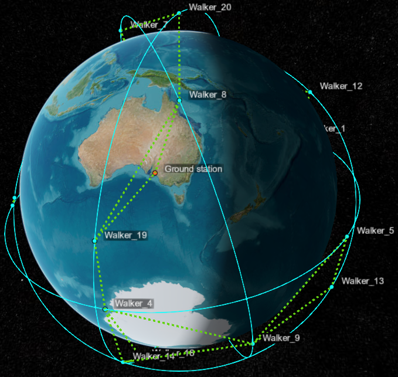
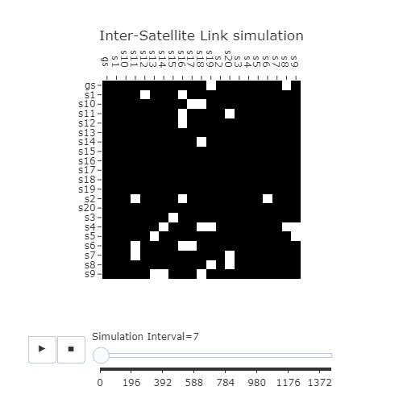

# SDN-based Space Systems Framework for Simulations (S3FS)

This project developed a simulation framework for SDN-based space systems for the Earth Observation use case. The framework implements dynamic Inter-Satellite Links (ISL) and a dynamic topology based on the orbital dynamics of the Walker Constellation. The framework is designed to simulate a constellation of satellites in low Earth orbit (LEO) that communicate with ground stations via satellite terminals connected through an SDN network. The framework allows for experimentation with different routing protocols through the POX controller.

For a detailed discussion of the S3FS framework refer to the following reference publication:

- Uhongora, U., Thinyane, M., & Law, YW. (2025) __"Development of an SDN-based Space Systems Simulation Framework for Intrusion Detection."__ IEEE International Conference on Cyber Security and Resilience (IEEE CSR), 4-6 August 2025, Crete - Greece.

## Simulation framework features:

- **Simulated Walker Constellation:** The simulation comprises a Walker-Delta constellation of 20 satellites arranged in a typical orbit pattern around Earth (see figure below). This is simulated using the Satellite Communications Toolbox of MATLAB with the following parameters: radius = 7200km, inclination = 70 degrees, number of orbital planes = 4, phasing = 1, and argument of latitute = 15 degrees. The orbital motion is simulated for 24 hours at per second resolution. 
    

        
    

- **SDN Network Simulation:** The simulation is based on a Software Defined Networking (SDN) architecture, where the network control plane is separated from the data forwarding elements. This allows for flexible configuration and management of the satellite network through programmable switches called OpenFlow switches. The framework utilizes the Mininet network simulation tool. 
- **Dynamic Inter-Satellite Links (ISL):** The framework dynamically creates ISLs based on the relative positions of satellites in orbit, ensuring that communication links are established only when necessary for data exchange between satellites and ground stations. The connectivity between the network nodes (i.e., the satellites and the ground station), represented as adjacency metrices between the networks nodes, across all the simulation intervals is available as a 3D numpy array in the repository (`walker_delta_20.npy`).  

   - This ISL connectivity data has a reduced per-minute resolution and therefore has a (21 x 21 x 1441) shape and contains binary values indicating whether an ISL exists between two nodes at a given interval. The graphic below shows an example ISL connectivity matrix for a single simulation interval.
    

        
    

- **POX Controller:** The framework uses the POX controller to experiment with different routing protocols, allowing users to test and evaluate the performance of various networking strategies within the simulated environment. However, the framework can be run with an other suitable OpenFlow controller as well. 
   - The default configuration of the POX controller uses the `forwarding.l2_learning`, `openflow.discovery`, `host_tracker`, and `openflow.spanning_tree` modules for network discovery and routing, but users can modify these settings or implement custom controllers and components as needed.
- **Traffic Generation:** The simulation framework includes a traffic generation functionality that allows for the creation of normal network traffic and attack network traffic between satellites and ground stations. The normal traffic is generated for the Earth Observation use case where data from the satellites are transmitted to the ground station, while the attack traffic represents various types of cyber-attacks such as denial-of-service (DoS) attacks or reconnaisance attacks targeting the variuos elements of the satellite network.
- **Simulation Metrics:** The framework provides two sets of metrics that can be used to evaluate the performance of the simulated network. 
   - The first set of metrics (stored in the file `metrics.csv`) track the number of network interfances added and removed, the elapsed CPU and wall time for the network reconfiguration, and the duration for the traceability test between the satellites and the ground station. 
   - The second set of metrics (stored in the file `pingmetrics.csv`) tracks the traceability of the ground station from each satellite by pinging the ground station from each satellite. These metrics track the number of pings sent and received, as well at the minimum, maximum, average, and standard deviation round-trip time for each traceability test.

## Using S3FS
Here are the basic instructions to get going with the simulation framework
- Set up your virtual machine or physical machine. S3FS has been tested on Ubuntu 24.04 and later versions, but it should work on other Linux distributions as well.
- Run the POX controller
   - Basic configuration `./pox.py forwarding.l2_learning openflow.spanning_tree --no-flood --hold-down openflow.discovery host_tracker`
   - With better logging `./pox.py forwarding.l2_learning openflow.spanning_tree --no-flood --hold-down log.level --DEBUG samples.pretty_log openflow.discovery host_tracker info.packet_dump`
- Set up your execution environment
   - Install required executables: `sudo apt install mininet hping3 nmap`
   - Set up a python virtual environment using your preferred tool e.g., `virtualenv`, `pyenv`, `pyenv-virtualenv`.
   - Load the required python packages from the requirements file `pip install -r requirements.txt`
- Modify the relevant parameters within the simulation script `s3fs.py`, in particular:
   - **CONTROLLER_IP** - The IP address of the controller
   - **OPENFLOW_VERSION** - The OpenFlow version to use; recommended 'OpenFlow10' for POX, 'OpenFlow13' for ODL or ONOS
   - **SIMULATION_INTERVAL** - The sleep time between simulation intervals; the default is 60 seconds.
   - **ISLDATA_FILE** - The ISL connectivity data file; the default is `walker_delta_20.npy`.
   - Check out other relevant parameters to modify in the simulation script, including normal and attack traffic generation parameters
- Run the simulation script `s3fs.py -t -r -a <attack> -i <interval>`
   - `t` : this is the test mode where the simulation runs for 3 (out of 1440) intervals, with a 10 second sleep time, and in the normal traffic generation mode.
   - `r` : this is the run mode where the simulation executes the full 1440 intervals with the default 60 seconds sleep time between intervals.
   - `i <inteval>` : in this mode the simulation will run up to the specified interval.
   - `a <attack>` : in this mode the simulation generates attack traffic based on the select attack type:
     - 1 : Syn Flood attack using `hping3`
     - 2 : Syn Flow Flood attack using `hping3`. This is a SYN flood with randomized source address to flood the OVS Switch flow tables
     - 3 : Port Scan attack using `nmap`
   - If you run `s3fs.py` without any arguments it will run in the test mode with no attack traffic generation.

## Future work
Some of the planned features to be added to S3FS include:
- **ISL bandwidth variation:** The current implementation assumes that all ISLs have a fixed bandwidth. In future versions, we plan to add support for varying bandwidths across different ISLs based on factors such as distance or other physical properties of the links.
- **Various use cases:** We aim to expand the simulation framework to include various use cases beyond the Earth Observation and the unicast payload download transmission. This could include scenarios involving data relay, satellite-to-satellite communication, or even more complex network configurations for specific applications.
- **Enhanced traceability testing:** The current implementation includes basic traceability testing between satellites and the ground station using ICMP echo requests (ping). Future versions may incorporate more sophisticated methods to test the reliability and latency of these connections.
- **Futher attack scenarios:** In addition to the current implementation of denial-of-service attacks, we aim to explore other types of cyber-attacks that could affect the performance of a satellite network, including SDN specific attacks.
- **Programmable data plane:** Implementing a programmable data plane in S3FS will allow for more sophisticated traffic management and control over the satellite network. This includes support for Quality of Service (QoS) mechanisms to prioritize certain types of traffic over others. 
- **Realistic network stack and satellite protocols:** The current implementation uses a simplified model of the satellite network stack and protocols. In future versions, we aim to implement more realistic models that incorporate aspects of actual satellite communication systems.
- **Other Enhancements:** We plan to continue enhancing the simulation framework with additional features such as support for different satellite constellations, adaptive routing algorithms, advanced network management capabilities, and a modular architecture that allows for easier extension and customization.
